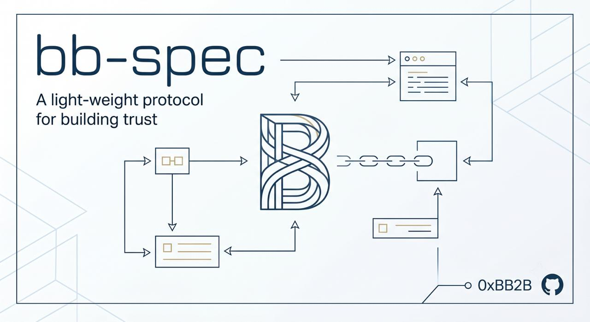
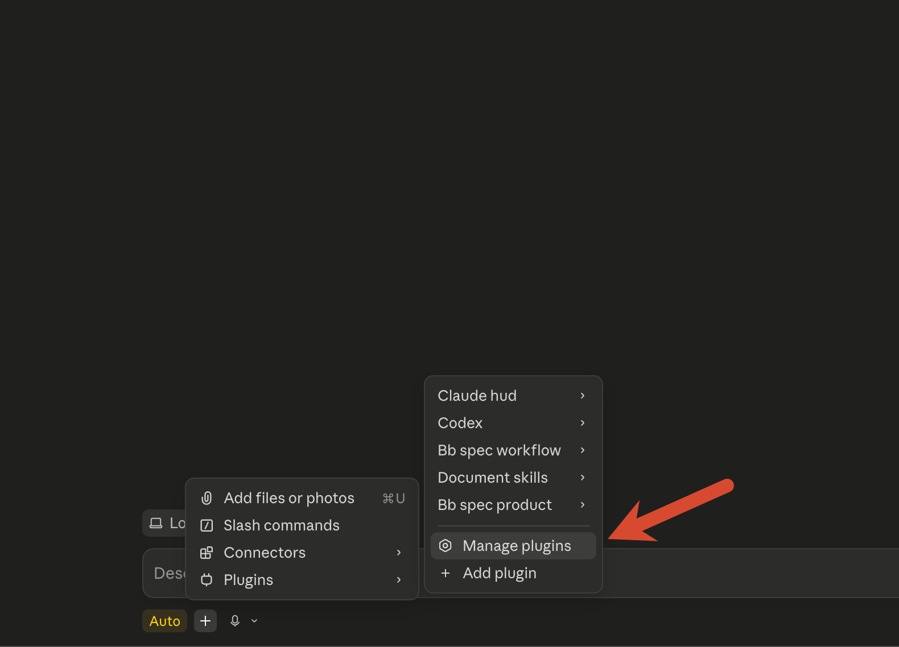
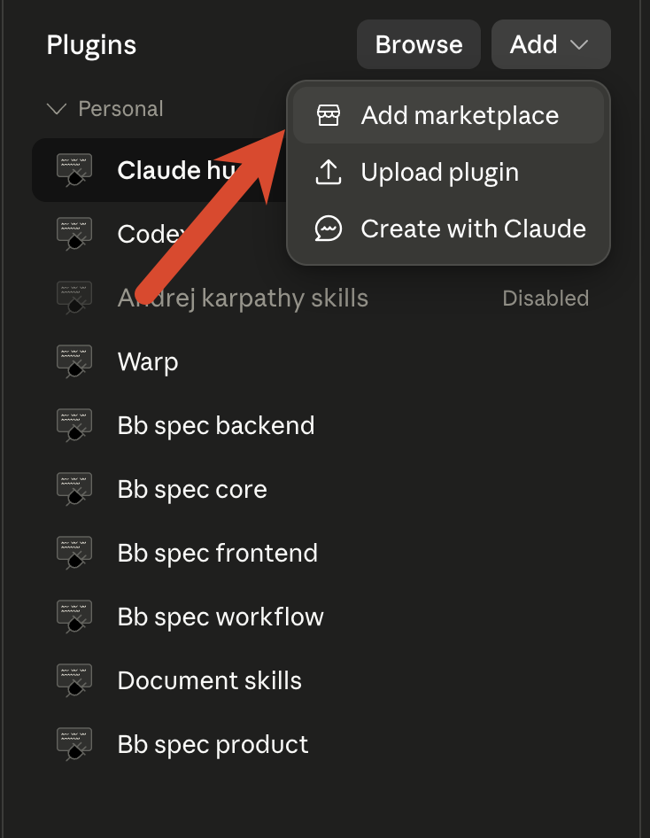
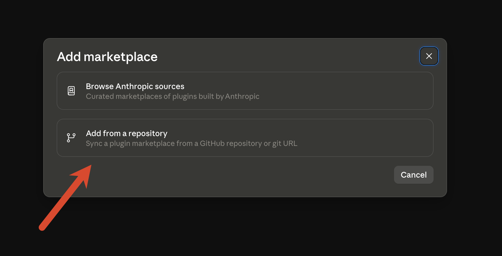
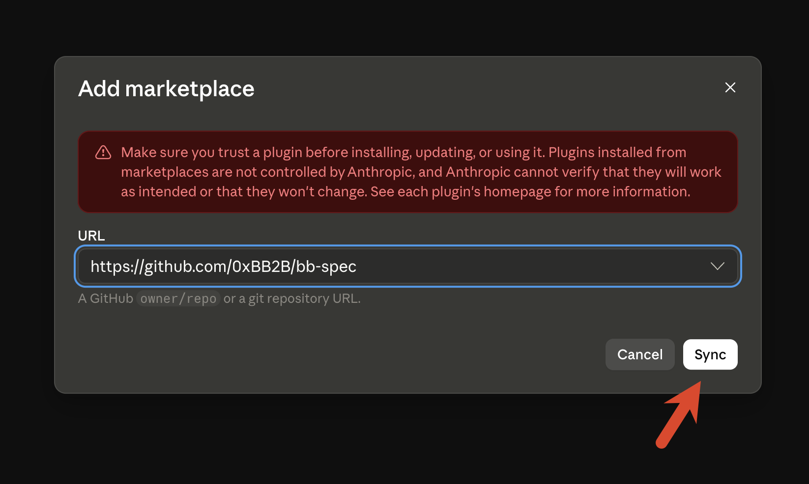
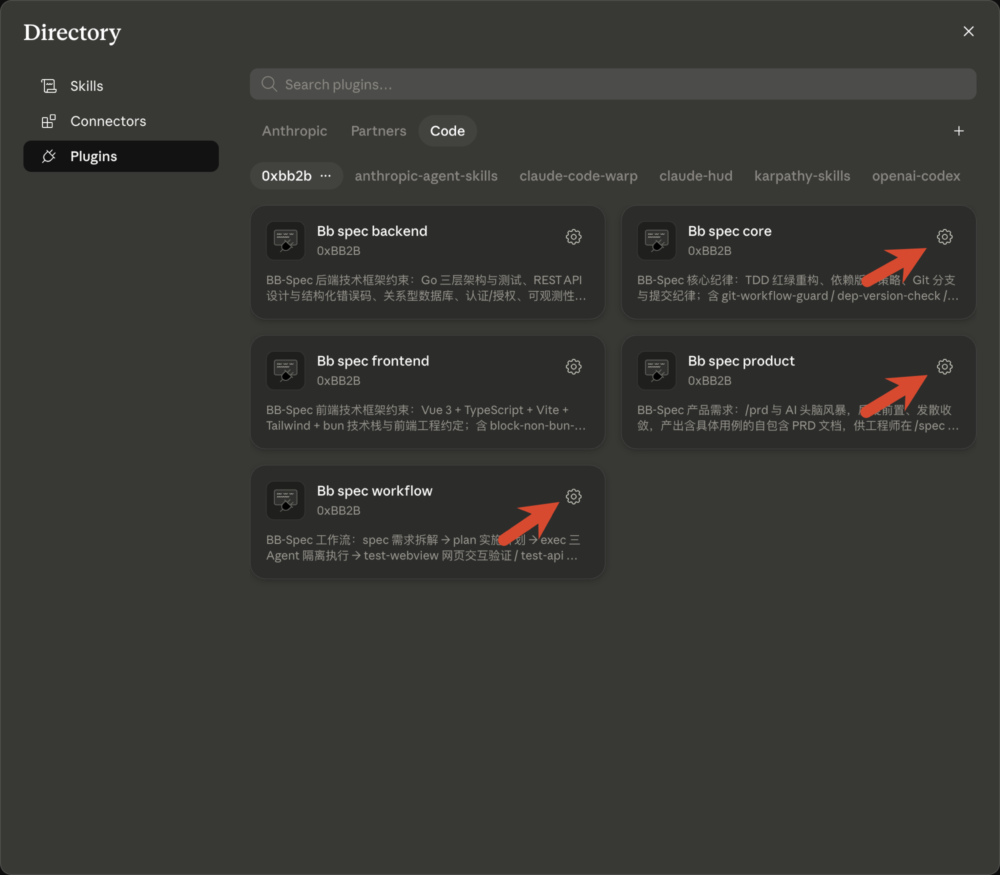
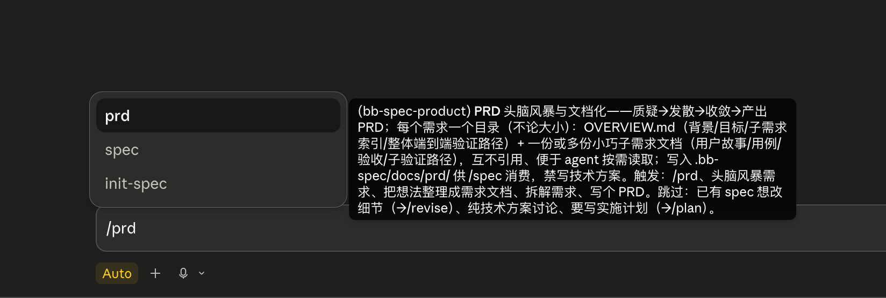

<p align="center">
  
</p>

<h1 align="center">📐 BB-Spec</h1>

<p align="center">
  <strong>모호한 요구사항을 출시 가능한 코드까지 운반하는 spec 기반 Claude Code 파이프라인.</strong>
</p>

<p align="center">
  모든 단계가 추적 가능 · 재개 가능 · 적대적으로 검증됨 —— Go / Vue + bun / TDD / Git 규율 스택 제약 스위트 동반.
</p>

<p align="center">
  <a href="#-claude-code-설치--install"><strong>Claude Code</strong></a> 와 <a href="#-opencode-설치--install-opencode"><strong>opencode</strong></a> 두 호스트를 모두 지원 —— 클릭하면 해당 설치 방법으로 바로 이동.
</p>

<p align="center">
  <a href="https://github.com/0xBB2B/bb-spec/actions/workflows/ci.yml?query=branch%3Amain"></a>
  <a href="https://github.com/0xBB2B/bb-spec/releases"></a>
  <a href="https://github.com/0xBB2B/bb-spec/stargazers"></a>
  <a href="LICENSE"></a>
  <a href="https://docs.anthropic.com/en/docs/claude-code/overview"></a>
</p>

<p align="center">
  <a href="./README.md">English</a> · <a href="./README.zh.md">简体中文</a> · <a href="./README.zh-TW.md">繁體中文</a> · <a href="./README.ja.md">日本語</a> · <strong>한국어</strong>
</p>

<p align="center">
  <a href="#-30초-만에-시작">빠른 시작</a> ·
  <a href="#-핵심-파이프라인-spec--ship">파이프라인</a> ·
  <a href="#-단계-개요">단계</a> ·
  <a href="#-동반-제약-skills">제약 Skills</a> ·
  <a href="#-claude-code-설치--install">설치</a> ·
  <a href="#-기본-활성화-hooks">Hooks</a> ·
  <a href="#-설계-유래선행-사례와-비교">설계 유래</a>
</p>

---

## 🚀 30초 만에 시작

```bash
/plugin marketplace add 0xBB2B/bb-spec
/plugin install bb-spec-core@0xbb2b
/plugin install bb-spec-workflow@0xbb2b
```

메인 파이프라인 5개 명령:

| 명령 | 무엇을 하는가 | 언제 사용 |
|---|---|---|
| `/spec` | 요구사항을 한 규칙 한 파일 spec으로 분해 | 새 요구사항 착수 시 |
| `/plan` | spec → 함수 수준 구현 계획 | spec 준비 완료 |
| `/exec` | 3개 에이전트 격리로 Test→Impl→Review 실행 | plan 준비 완료 |
| `/review` | 병렬 finder + 적대적 검증 | PR 제출 전 |
| `/git-push` | pre-review 자가 점검 + push + PR 생성 | 출시 준비 |

언제든 개입 가능한 3개 보조 라인: `/git-clone`(원격 프로젝트를 로컬로 가져오기 + `.bb-spec.yaml` 생성 일회성 onboarding), `/revise`(모든 편차를 근본 원인에 따라 올바른 단계로 라우팅), `/doc-update`(저장소 전체 spec/문서/코드 일관성 점검).

선택적 상류: `/prd`(PM / 의뢰자가 PRD를 브레인스토밍, bb-spec-product로 별도 제공).

---

## 🔁 핵심 파이프라인 `spec → ship`

```
 (선택) /git-clone ──► 원격 가져오기 + .bb-spec.yaml 생성
   │
 (선택) /prd ──► PRD 문서
   │
 /spec ──► /plan ──► /exec ──► /review ──► /git-push
  무엇을      어떻게    Red→Green→Review  병렬+적대  pre-review+PR 생성
                                                          │
        ┌─────────────────────────────────────────────────┘
        │
        ▼ /revise (언제든 개입, 근본 원인으로 라우팅)
          spec 결함 → /spec   ·   구현 드리프트 → /exec   ·   review 지적 → 핀포인트 수정

 (선택) /test-webview · /test-api — 프론트 / 백엔드 e2e, /exec 와 /review 사이에 삽입
 /doc-update (정기 / 필요 시) — 저장소 전체 드리프트 스캔 → 기본은 spec/문서 갱신,
                                  명백히 부적절한 코드는 멈추고 확인 → /revise로 라우팅
```

**이 파이프라인이 신뢰할 만한 이유** —— 모든 인계물은 **디스크 상의 파일**이며 채팅 내 일시 기억이 아니다. 이것이 재개 가능, AI 교체 가능, 종단 간 추적 가능의 근본이다.

### 🎯 단계 개요

- **`/git-clone`** — *일회성 onboarding*: 원격 저장소를 로컬로 가져오고 `.bb-spec.yaml`을 작성한다.
  - **AskUserQuestion 2연발**: ① 단일 리포 / 멀티 리포 워크스페이스(디렉터리 구조 결정) ② `base_dir`(이후 모든 bb-spec 산출물의 배치 결정)
  - **멀티 리포 워크스페이스**는 공통 부모 디렉터리를 만들고 각 멤버 저장소를 개별 clone(빌드 도구가 기대하는 상대 배치 복원), 중첩 금지·덮어쓰기 금지
  - 책임을 엄격히 좁힘: **코드만 가져오고 `base_dir`만 작성**, 코드를 읽지 않고·의존성을 설치하지 않음

- **`/spec`** — 대화를 통한 요구사항 분해, **"무엇을 만들 것인가"**에 답한다.
  - 한 파일 한 규칙, ≤100줄, 한 가지 + 예시 하나, 서로 중복 없음
  - 경량 `INDEX.md`가 통솔, 독자는 인덱스를 스캔한 후 필요에 따라 로드

- **`/plan`** — spec → 자기 완결형, **함수 수준** 구현 계획, **"어떻게 만들 것인가"**에 답한다.
  - 한 파일 한 독립 문제, 함수명과 책임까지 상세화; 선언형 산출물(DDL / API 계약 / 설정)은 **최종 산출물 형태로 직접 인라인**, exec이 그대로 작성
  - 호출 시 **plan 모드 읽기 전용 정렬**에 진입, 승인 후에만 작성; **신규 제3자 의존성은 별도 섹션**, 승인은 version-policy가 요구하는 사용자 동의로 간주

- **`/exec`** — **3 에이전트 격리 실행**, 부정행위 방지 핵심 설계.
  - *Test* 에이전트는 spec 규칙만 읽고 실패 테스트를 작성(Red)
  - *Impl* 에이전트는 **spec을 보지 않음**, 테스트 + 함수 목록만 보고 구현 작성(Green), "의도에 맞춰 부정"할 수 없음; 신규 제3자 라이브러리는 plan에서 승인된 의존 목록에 제한
  - *Review* 에이전트는 spec과 대조하여 점검, 읽기 전용
  - 각 단계의 진행을 `PROGRESS.md`에 기록, token 소진 시에도 **무손실 재개** 가능

- **`/test-webview`** — 프론트엔드 / 웹 프로젝트의 **상호작용 인수**.
  - Docker 전체 스택 기동(최초 확인 후 기억, 완료 시 `down -v`로 정리), 브라우저 MCP로 실제 브라우저 구동
  - **각 케이스마다 격리된 직렬 subagent 할당**, 수백 케이스에도 메인 컨텍스트를 폭발시키지 않음; 전 과정 직렬(브라우저 단일 인스턴스)
  - 케이스는 spec / plan / PRD에서 자동 생성; 실행 전 **커버리지 정렬**, 갭을 침묵으로 누락시키지 않음; 실패는 `/revise`로 전환
  - 브라우저 MCP(playwright / chrome-devtools) 필요

- **`/test-api`** — 백엔드 **API e2e**.
  - `compose.e2e.yaml`로 전체 스택 기동, md 케이스를 **기계적으로 단일 파일 Bun TS runner로 렌더링**, `bun run`으로 한 번에 실행
  - **subagent 제로, 동시성 제로** —— HTTP는 결정적 스크립트, 시계 상태가 공유되므로 동시성 금지
  - **시간 민감 규칙**(token 만료, 주문 타임아웃, 포인트 만료)은 `/test/advance-time`, `/test/backdate`, `/test/trigger-job` 프로토콜로 테스트
  - 앱 측은 **두 개의 이미지 산출**: test 이미지는 `/test/*` 라우트 + `ENV TESTAPI=1` 탑재; 운영 이미지는 `/test/*` 소스를 **물리적으로 제외**; `/test/healthz` 프로브 실패 시 즉시 중단, 폴백 금지

- **`/review`** — Workflow 오케스트레이션, **적대적 검증**을 갖춘 로컬 PR review.
  - Phase 1에서 **6개 finder** 병렬 실행: 코드 품질 / 보안 / 간결성 / 견고성 / 문서 동기화 / **Codex 크로스 모델 독립** review, schema 강제 구조화
  - Phase 2에서 각 🔴/🟡을 **3개 독립 회의 관점**으로 재판정(중요도 / 근본 원인성 / 미수정 위험), 다수결로 잔존 결정
  - 읽기 전용, 절대 자동 편집하지 않음; Claude Code ≥ 2.1.154 필요

- **`/revise`** — 언제든 개입 가능한 예외 처리.
  - 편차를 **근본 원인으로 3분류**: *spec 결함*(→ `/spec`), *구현 드리프트*(→ `/exec`), *요구사항 변경*
  - 수정이 필요한 모든 review 지적은 여기로 집결

- **`/git-push`** — 사용자 트리거 push + PR 흐름(단일 / 다중 저장소).
  - spec `INDEX.md`가 있을 때 먼저 **브랜치 규범 자가 점검(pre-review)** 실행: subagent가 spec vs 브랜치 diff를 비교, 위반을 반복 수정
  - **6개 섹션 PR 설명**(배경 / 요구사항 / 접근법 / 결과 / 테스트 / 규범, < 50줄)을 기초하여 그대로 PR body로 사용

- **`/doc-update`** — 저장소 전체 spec / 문서 / 코드 **일관성 점검**.
  - 6종 드리프트 분류: spec-stale / doc-stale / code-violation / spec-conflict / orphan-index / uncovered-rule
  - **코드가 진실, spec / 문서는 코드에 맞춤**; 코드가 명백히 하드 제약을 위반할 때만 멈추고 확인, `/revise`를 통해 TDD로 진행
  - `/revise`(단일 지점), `/review`의 `review-doc-sync`(PR diff 범위)와 경계를 명확히

**동봉되는 것**

- **11개 오케스트레이션 subagent**(위 단계에 의해 구동): `test-engineer` / `impl-engineer` / `spec-reviewer` / `webview-test-runner` / `review-code-quality` / `review-security` / `review-simplicity` / `review-robustness` / `review-doc-sync` / `review-codex` / `pre-reviewer`
- **4개 수동 hook**(자동 발동): npm/yarn 차단, main 커밋 차단, 의존성 버전 자가 점검, Stop 시 4항목 자가 점검

---

## 🧩 동반 제약 Skills

위 파이프라인에 규칙을 공급 —— 필요한 레이어만 설치.

### bb-spec-product — 제품 요구사항(파이프라인 상류)

- **`prd`** — PM / 의뢰자가 AI와 브레인스토밍: 질의 전치(거부도 유효한 결과) → 발산 → 수렴, 자기 완결형 PRD 생성 —— 목표 / 비목표, 우선순위 사용자 스토리(각 P0에 구체적 유스케이스와 인수 기준 부여), 엔지니어에게 남길 열린 질문; git 저장소나 코드 컨텍스트 불필요, `/spec`이 직접 소비

> **PM은 Claude Code 불필요**: 매 릴리스마다 [`bb-spec-prd-skill.zip`](https://github.com/0xBB2B/bb-spec/releases/latest/download/bb-spec-prd-skill.zip)을 자동 패키징, 다운로드 후 claude.ai 웹 / 데스크톱 버전의 **Settings → Customize → Skills**에 업로드하면 skill을 단독으로 사용 가능(유료 플랜과 코드 실행 활성화 필요), 생성된 PRD는 다운로드 가능한 파일로 엔지니어에게 전달.

### bb-spec-core — 범용 규율

- **`tdd-workflow`** — Red-Green-Refactor 규율, 추가 / 수정 / 삭제 3 시나리오 표준 흐름 커버
- **`version-policy`** — 표준 / 공식 라이브러리 우선, 신규 제3자 라이브러리 도입은 사용자의 명시적 동의 필요(plan에서 승인된 의존 목록은 동의로 간주); 버전 고정 전 의존성의 공식 최신 버전 확인, 훈련 기억에 의존 금지
- **`git-workflow`** — 브랜치 결정, 단계적 commit, 6개 섹션 PR 설명, 머지 후 정리

### bb-spec-backend — 백엔드 스택 제약

- **`golang-constraints`** — Go 전체 라이프사이클: 3계층 아키텍처, 과잉 추상화 금지, 테스트는 운영 설계에 종속
- **`golang-testing`** — Go 테스트 구성: table-driven, subtests, benchmark, fuzz
- **`api-design`** — REST 설계: 리소스 명명, 상태 코드, 페이지네이션, `A-BBB-CCCC` 구조화 에러 코드
- **`database-constraints`** — 앱 계층 UUIDv7 기본 키, 소프트 삭제 + 복합 UNIQUE, DB 관리 타임스탬프, 종단 간 UTC
- **`auth-constraints`** — 인증(authN): 듀얼 token(JWT + 불투명 refresh) 로테이션 + 재생 탐지, 슬라이딩 만료, argon2id
- **`authz-constraints`** — 인가(authZ): 기본 거부, 판정 집중, 거시 역할 + 미시 리소스 ownership 2단계 체크로 IDOR 방지
- **`observability-constraints`** — 로그 / 트레이스 / 메트릭을 OTel 기반: 일회 조립, 구조화 JSON + 안정된 trace_id, 라벨 카디널리티 제한
- **`service-constraints`** — 런타임 거버넌스: env 주입 시크릿의 fail-fast, 우아한 라이프사이클, 쓰기 멱등성, 타임아웃 + 안전한 재시도
- **`config-constraints`** — 설정 캐리어 3분류: env/secret은 시작 필수이며 핫 업데이트 불가, yaml/configmap은 핫 업데이트 가능한 기본값, DB는 동적 비즈니스 설정; 핵심 자격증명은 secret/KMS만, DB로 내릴 경우 envelope encryption 필수

### bb-spec-frontend — 프론트엔드 스택 제약

- **`vue-constraints`** — Vue 3 + TypeScript + Vite + Tailwind + bun 스택 강제 제약
- **`frontend-constraints`** — 엔지니어링 규약: 통일된 요청 client, 에러 코드→UI 매핑 집중, UX 전용 라우트 가드, 계약에서 유래한 타입

---

## 🧭 플랫폼 대조 / Claude Code vs opencode

두 호스트가 제공하는 것은 **동일한 내용**입니다: 26개 skills, 11개 오케스트레이션 subagent, 4개 워크플로 가드 hook(동작 동등)을 단일 버전 라인에서 잠금 동기화로 릴리스합니다. 차이는 배포 방식과 호스트 메커니즘뿐이니 사용 환경에 맞춰 하나를 선택해 설치하세요(방법은 아래 두 절 참조):

| 항목 | Claude Code | opencode |
|---|---|---|
| 배포와 설치 | 5개 서브 plugin, marketplace에서 필요한 계층만 설치 | 단일 npm 패키지 `opencode-bb-spec`, `opencode.json`에 한 번 선언해 일괄 설치 |
| 명령 진입점 | 26개 skill 모두 `/이름` 슬래시 호출 가능, 상황에 따른 자동 트리거도 지원 | 11개 파이프라인 command(`/spec` `/exec` `/review` …), 나머지 skill은 모델이 필요 시 자동 로드 |
| 크로스 모델 review | review-codex는 codex 플러그인 경유로 파견 | review-codex는 로컬 `codex` CLI 직접 호출 |
| 업데이트 | `/plugin update` | npm 패키지 버전 업그레이드 |

## 📦 Claude Code 설치 / Install

BB-Spec은 **5개의 독립 설치 가능한 서브 plugin**으로 분할 —— 필요한 제약 레이어만 설치.

먼저 marketplace를 한 번 추가(Claude Code 내에서 실행):

```bash
/plugin marketplace add 0xBB2B/bb-spec
```

다음으로 필요한 레이어를 설치:

| 서브 plugin | 무엇을 얻는가 | 설치 명령 |
|---|---|---|
| **bb-spec-core** _(권장 베이스)_ | TDD / 버전 정책 / Git 규율 + 3개 수동 hook | `/plugin install bb-spec-core@0xbb2b` |
| **bb-spec-workflow** _(핵심 기능)_ | spec → plan → exec → review → revise → git-push(+ 선택 test-webview / test-api e2e), git-clone 일회성 초기화, init 역방향 spec, doc-update 저장소 전체 일관성 유지 + 11개 subagent | `/plugin install bb-spec-workflow@0xbb2b` |
| **bb-spec-product** | /prd 요구사항 브레인스토밍 → 구체적 유스케이스가 포함된 PRD 문서(PM / 의뢰자용) | `/plugin install bb-spec-product@0xbb2b` |
| **bb-spec-backend** | Go / REST API / DB / 인증 / 인가 / 가관측성 / 서비스 거버넌스 / 설정 제약 | `/plugin install bb-spec-backend@0xbb2b` |
| **bb-spec-frontend** | Vue 3 + TS + Vite + Tailwind + bun 스택 & 엔지니어링 규약(bun hook 포함) | `/plugin install bb-spec-frontend@0xbb2b` |

필요에 따라 선택 —— 예를 들어 규율과 워크플로만 필요하고 스택 의견은 불필요: `bb-spec-core` + `bb-spec-workflow` 설치; PM / 의뢰자의 머신: `bb-spec-product`만; 풀 세트: 5개 모두 설치.

또는 `~/.claude/settings.json`에 수동 추가(원하는 것만 enable):

```json
{
  "extraKnownMarketplaces": {
    "0xbb2b": {
      "source": { "source": "github", "repo": "0xBB2B/bb-spec" }
    }
  },
  "enabledPlugins": {
    "bb-spec-core@0xbb2b": true,
    "bb-spec-workflow@0xbb2b": true,
    "bb-spec-product@0xbb2b": false,
    "bb-spec-backend@0xbb2b": false,
    "bb-spec-frontend@0xbb2b": false
  }
}
```

### Claude Code 데스크톱 앱에서 설치(스크린샷 포함)

Claude Code 데스크톱 앱(Mac / Windows) 대상. 전 과정 GUI 조작이며 명령 입력은 필요 없습니다.

**1. 플러그인 관리 패널 열기**

입력란의 `+` → `Plugins` → `Manage plugins`:

<p align="center">
  
</p>

**2. marketplace 추가**

Plugins 패널 우측 상단의 `Add` → `Add marketplace`:

<p align="center">
  
</p>

**3. 리포지토리에서 추가 선택**

다이얼로그에서 `Add from a repository` 선택:

<p align="center">
  
</p>

**4. bb-spec 리포지토리 URL 입력 후 동기화**

URL 에 `https://github.com/0xBB2B/bb-spec` 입력 후 `Sync` 클릭:

<p align="center">
  
</p>

**5. 핵심 3종 세트 활성화**

Directory 에 bb-spec 의 5개 서브 플러그인이 표시됩니다. `Bb spec core` / `Bb spec workflow` / `Bb spec product` 세 카드 우측 상단의 톱니바퀴 아이콘을 클릭해 각각 활성화(backend / frontend 는 필요에 따라):

<p align="center">
  
</p>

**6. 설치 확인**

입력란으로 돌아가 `/prd` 입력. 명령 자동완성이 표시되면 설치 성공입니다:

<p align="center">
  
</p>

## 🔌 opencode 설치 / Install (opencode)

BB-Spec은 [opencode](https://opencode.ai) 플러그인 버전도 제공합니다. 단일 npm 패키지로 26개 skills, 11개 subagent, 11개 command, 4개 워크플로 가드 hook 전체를 제공합니다(Claude Code 전용 codex 크로스 플러그인 참조 제외 기능 동등——크로스 모델 review는 로컬 codex CLI를 직접 호출).

`~/.config/opencode/opencode.json`(전역) 또는 프로젝트 `opencode.json`에 선언하세요:

```json
{
  "$schema": "https://opencode.ai/config.json",
  "plugin": ["opencode-bb-spec"]
}
```

opencode 재시작 후 `opencode debug skill`로 확인합니다. 자세한 내용과 Claude Code 버전과의 대응표는 [opencode/README.md](opencode/README.md)를 참조하세요.

## 🔄 버전 관리 / Versioning

```bash
/plugin update                  # 설치된 모든 plugin 확인 및 업데이트
/plugin update bb-spec-core     # 특정 서브 plugin만 업데이트
```

5개의 서브 plugin은 단일 동기화된 버전 라인을 공유.

---

## 🪝 기본 활성화 Hooks

각 hook은 「해당 관심사를 담당하는 서브 plugin」과 함께 배포 —— 대응하는 plugin을 설치해야 사용 가능.

| Hook | 소속 서브 plugin | 트리거 시점 | 효과 |
|---|---|---|---|
| `block-non-bun-pm` | bb-spec-frontend | PreToolUse(Bash) | `npm` / `yarn` / `pnpm`의 패키지 관리 동작을 차단하고 `bun` 강제; 기존 프로젝트에 매칭되는 lockfile(예: `package-lock.json`)이 존재할 경우 통과 |
| `git-workflow-guard` | bb-spec-core | PreToolUse(Bash) | `main` / `master` 브랜치의 `git commit` 차단; 다른 git 흐름 동작(브랜치 생성 / push / worktree / merge / PR)은 통과시키고 git-workflow 규율과 실시간 git 상태 주입 |
| `dep-version-check` | bb-spec-core | PostToolUse(Write\|Edit) | 의존성 파일 편집 후 "공식 최신 버전 먼저 확인" 자가 점검 리마인더 주입 |
| `stop-self-check` | bb-spec-core | Stop | 태스크 종료 전 4항목 자가 점검 강제: 임시 파일 / 변경 범위 / 고립 잔재 / 레거시 유물 |

---

## 🧪 테스트

```bash
bash tests/validate.sh
```

다중 plugin 구조 검증: marketplace.json 유효성과 plugin 엔트리 일관성(각 `source`가 실재하며 이름이 일치하는 plugin 디렉터리를 가리킴), 각 서브 plugin의 plugin.json 필드, agent frontmatter 완전성(필수 필드, 이름 일관성, 유효한 agent-type 값, 보안 베이스라인 섹션), skill SKILL.md 포맷, hooks.json 유효성 및 스크립트 존재, 개인 경로 누출 탐지.

CI는 PR과 main 푸시 시 자동 실행(`.github/workflows/ci.yml`).

---

## 🛠️ 권장 동반 자료

### CLAUDE.md 템플릿

저장소 루트의 [`CLAUDE.template.md`](./CLAUDE.template.md)는 동반 「철칙 인덱스」 참고 자료. **자동 설치되지 않음** —— 필요에 따라 `~/.claude/CLAUDE.md` 또는 프로젝트 루트의 `CLAUDE.md`에 복사하고 취향에 맞게 가지치기.

### .bb-spec.yaml 프로젝트 설정

`/prd`, `/spec`, `/plan`은 기본적으로 `.bb-spec/docs/` 아래로 출력(`.bb-spec/docs/prd/`, `…/spec/`, `…/plan/`); 런타임 일시 산출물(예: webview 스크린샷)은 인접한 `.bb-spec/.cache/`로(자동 gitignore). 프로젝트 루트에 `.bb-spec.yaml`을 생성하여 bb-spec 루트 디렉터리를 재정의 가능:

```yaml
base_dir: my/bb  # → my/bb/docs/{prd,spec,plan,test}/ 와 my/bb/.cache/ ; ./을 지정하면 프로젝트 루트에 직접 배치
```

참고 템플릿: [`.bb-spec.template.yaml`](./.bb-spec.template.yaml).

---

## ⚙️ Hook 스위치 치트시트

| 시나리오 | 스위치 |
|---|---|
| 일시적으로 npm / yarn / pnpm 허용 | `bb-spec-frontend`를 일시적으로 비활성화 |
| 일시적으로 main commit 허용 | `bb-spec-core`를 일시적으로 비활성화 |
| Stop 자가 점검 건너뛰기 | 스위치 없음 —— 이것은 핵심 철칙, 건너뛰기 권장하지 않음 |

---

## 💡 설계 유래: 선행 사례와 비교

BB-Spec은 세 개의 우수한 프로젝트의 어깨 위에 서 있다. 각각이 BB-Spec 설계의 다른 부분을 형성했다 —— 아래 표에서 그 공로를 기리고, BB-Spec이 무엇을 차용했으며 그 아이디어를 어디까지 발전시켰는지 설명한다.

| 프로젝트 | 무엇이 가장 뛰어난가 | BB-Spec이 차용하고 강화한 점 |
|---|---|---|
| [**Superpowers**](https://github.com/obra/Superpowers)(obra) —— 완전한 코딩 에이전트 방법론 | 종단 간 단계화된 워크플로, 서브에이전트 기반 개발 + 단계별 리뷰, TDD 레드-그린-리팩터, git worktree 격리, 소크라테스식 브레인스토밍, 조합 가능한 스킬 라이브러리 | 전체 `spec → ship` 파이프라인 골격, 역할별 서브 Agent 협력, 강제 TDD, 다단계 / 적대적 리뷰, 대화 우선 요구사항 명확화 |
| [**ECC**](https://github.com/affaan-m/ECC)(affaan-m) —— 에이전트 하네스 「운영 체제」 | agents / skills / hooks / rules의 대규모 계층 체계, 수동 hook의 자동 강제, 인프라로서의 규칙, 세션 간 메모리 지속화 | 계층화된 독립 설치 가능 서브 플러그인 스위트, 수동 hook으로 규율 강제, 엔지니어링 규약을 로드 가능한 제약 skill로 침전 |
| [**skills**](https://github.com/mattpocock/skills)(mattpocock) —— 「Skills For Real Engineers」 | 실제 실패 모드(요구사항 불일치 / 장황함 / 품질 / 아키텍처)에 초점, 의도를 정렬하는 심층 질문, 공유 도메인 언어, 사용자 호출 vs 모델 호출 이중 형태 skill, 수직 슬라이싱 | 질의 전치, 코딩 전 대화로 요구사항 확정, 듀얼 트리거 skill(slash 명령 + 모델 자동 트리거), 한 파일 한 규칙의 미니멀리즘 |

**BB-Spec 고유의 선택** —— 셋 모두가 동시에 갖추지 못한 차별화 요소:

- **3 에이전트 격리 실행** —— Impl 에이전트는 *물리적으로 spec을 보지 못함*, 테스트만 보므로 "의도에 맞춰 속임"이 불가능; 테스트, 구현, 리뷰는 서로 보지 못하는 3자가 각각 완성.
- **유일한 인계물로서의 디스크 문서** —— 각 단계의 인계는 채팅 기억이 아닌 파일, 따라서 세션 횡단, `/clear`, 심지어 다른 모델의 인수에서도 무손실 재개 가능.
- **spec ⇄ code 양방향 루프** —— spec → code뿐 아니라 `/doc-update`로 저장소 전체 드리프트를 스캔해 spec을 코드 현재 상태에 지속적으로 추종.

---

## 📜 License

MIT —— 자세한 내용은 [LICENSE](./LICENSE) 참조.

<p align="center">
  <sub>Built with ❤️ for the Claude Code community.</sub>
</p>
